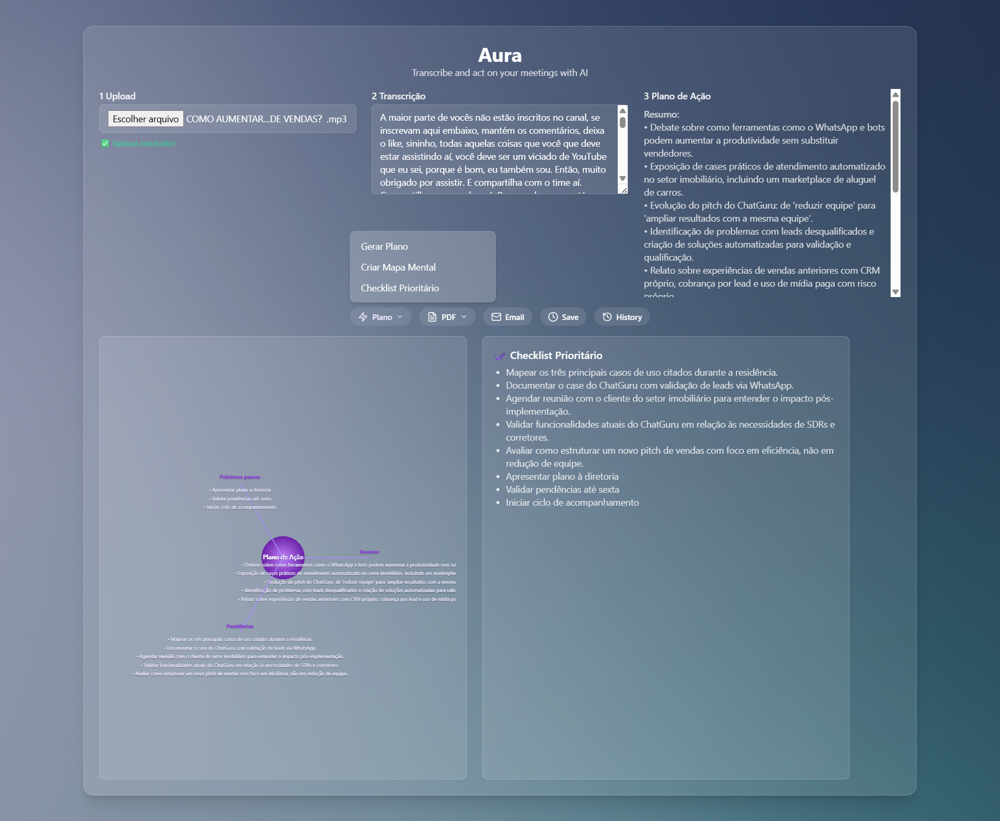
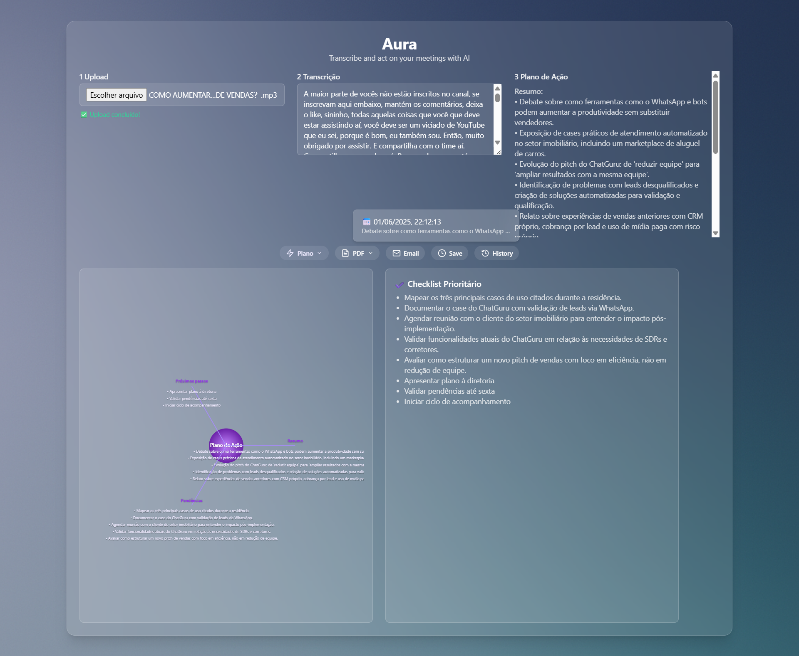
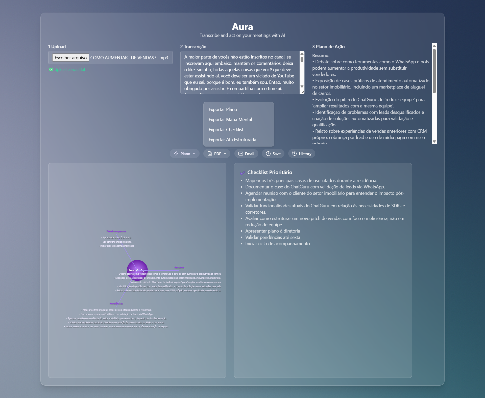

# 🔮 Aura — Transcreva e aja com inteligência


O **Aura** transforma gravações de reuniões em planos de ação organizados, checklist priorizado e mapa mental interativo — tudo com IA e visual refinado.

---

## ✨ Funcionalidades

- 🎙️ Upload de áudio (.mp3)
- ✍️ Transcrição automática com IA
- 📋 Plano de ação: Resumo, Pendências e Próximos passos
- 🧠 Mapa Mental SVG dinâmico
- ✔️ Checklist Prioritário gerado automaticamente
- 📄 Exportação em PDF (Plano, Checklist, Mapa)
- 📧 Envio por e-mail (mock)
- 🕒 Histórico local (salvamento + restauração)

---

## 🧠 Interface

### 🔁 Upload + Transcrição + Plano


### 🧠 Mapa Mental + Checklist Prioritário


### 📄 Exportações em PDF


---

## 🚀 Como usar localmente

```bash
# 1. Clone o repositório
git clone https://github.com/elevenMind
cd aura

# 2. Instale o backend
cd backend
npm install
npm start

# 3. Em outro terminal, inicie o frontend
cd ../frontend
npm install
npm run dev```

## 🧱 Estrutura

aura/
├── frontend/
│   ├── public/          # Prints para vitrine
│   └── src/components/  # Componentes TSX
├── backend/             # API Express
├── README.md
└── .gitignore


## 📦 Status do Projeto

Este é um MVP real com dados gerados por IA, mas com partes ainda mockadas (ex: análise do plano de ação).
Está pronto para demonstrações, testes reais, e conexão com APIs pagas como OpenAI/Whisper.

## 🙌 Contribuições

Aberto a feedbacks, contribuições e sugestões de melhorias!
Se quiser propor uma feature, use Issues ou faça um PR.

## 👨‍💻 Autor

Desenvolvido por: **Elemar Jr**  
[GitHub — @elevenMind](https://github.com/elevenMind)  
[LinkedIn — Elemar Schmidt Jr](https://www.linkedin.com/in/elemar-schmidt-jr-4bb76b173/)
